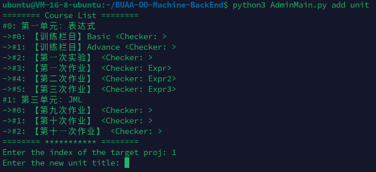

# BUAA-OO-Machine-BackEnd

BUAA 面向对象课程对拍机，这里是**后端**部分！

## 安装与部署

我感觉 Ubuntu 自带的 Python3 就可以了，应该要 >= 3.10 吧。

使用

```sh
pip install fastapi timeout_decorator python-multipart pyzipper
```

安装依赖，并使用

```sh
nohup python3 ServerMain.py&
```

运行并置于后台即可。当然建议先确保能用，再重新启动，放置后台。

服务器日志会存储在 `uvicorn.*.log` 中。

默认端口是 **5080** 你可以在 `ServerMain.py` 的最后一行中修改。


## 新建课程、作业与自定义对拍脚本

使用 `AdminMain.py` 可以在后台修改数据库。



`python3 AdminMain.py set version` 可以设置前端最新的版本号（正整数），前端会检查更新，并提醒用户进行更新。

`python3 AdminMain.py add proj` 可以新建**单元**，后续按照提示输入信息即可。

`python3 AdminMain.py add unit` 可以在课程中新建**作业**，后续按照提示输入信息即可。

注意这里的英文和实际上课程内容的对应关系！！

新建作业时，会要求输入测评方法 （Judge Method），输入的内容实际上为 `checkers/__init__.py` 中 `Checker` 字典的**键**！

具体可见 `checkers/CheckerTemplate.py` 及其中的注释。

测评方法有三种，含义如下：

```python
class CheckerMetadata(Enum):
    Mutual = 1   # 互相对拍
    Checker = 2  # 只由测评机检查
    Both = 3     # 即先交给测评机检查，正确后再和其他正确的同学“对拍”
```

注意，`Both` 看上去很多此一举，但加入你又要和同学们比较输出长度，又要检查正确性，那就很有用了。

`_check_main` 返回一个 `tuple`，第一个 `bool` 参数表示一致与否，或者正确与否，第二个 `str` 参数为提示信息。

一个例子如下：

```python
# checkers/Expr1.py

import random
from typing import IO

from checkers.CheckerMetadata import CheckerMetadata


def pre_handle(s):
    out = ""
    num_temp = ""
    for c in s:
        if c.isdigit():
            num_temp += c
            continue
        if num_temp != "":
            num_temp = num_temp.lstrip("0")
            out += num_temp if num_temp != "" else "0"
        num_temp = ""
        if c == '^':
            out += '**'
        else:
            out += c
    if num_temp != "":
        num_temp = num_temp.lstrip("0")
        out += num_temp if num_temp != "" else "0"
    return out


def _check_main(**kwargs) -> (bool, str):
    fin: IO = kwargs.get("fin")
    fout: IO = kwargs.get("fout")
    fcmp: IO = kwargs.get("fcmp")

    if fcmp is not None:
        # Mutual
        self_len = len(fout.read(5002).strip(" \n\t"))
        other_len = len(fcmp.read(5002).strip(" \n\t"))
        return self_len <= other_len, f"Len={other_len}"

    stdin = fin.read().strip(" \n\t")
    stdout = fout.read(5002).strip(" \n\t")

    if len(stdout) > 5000:
        return False, f"Output Too Long!"

    if '(' in stdout or ')' in stdout:
        return False, "Has '(' or ')' in your answer!"

    length = len(stdout)
    stdin = pre_handle(stdin)
    stdout = pre_handle(stdout)

    for _ in range(100):
        x = random.randint(-1000, 1000)
        try:
            if eval(stdin) != eval(stdout):
                return False, f"Wrong Answer When x = {x}"
        except Exception as e:
            return False, f"Checker Error When x = {x} For {repr(e)}"
    return True, f"Len={length}"


CompareType = CheckerMetadata.Both

# 给测评机调用的
Fn = _check_main
```

因此，`checkers/__init__.py` 就要做如下修改：

```python
# checkers/__init__.py

import checkers.Expr1

Checkers = {
    "Expr1": (Expr1.CompareType, Expr1.Fn),
}
```

于是，在新建这一次作业时，judge-method 应该填写 `Expr1`。

**很遗憾，目前的后端无法做到新对拍脚本的热加载**。
