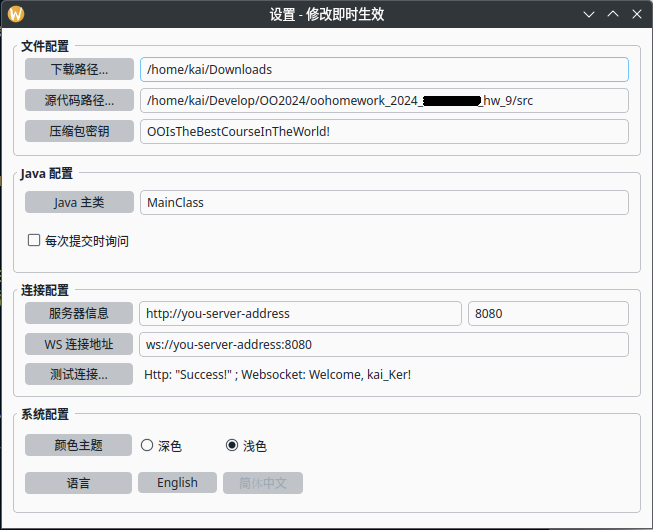
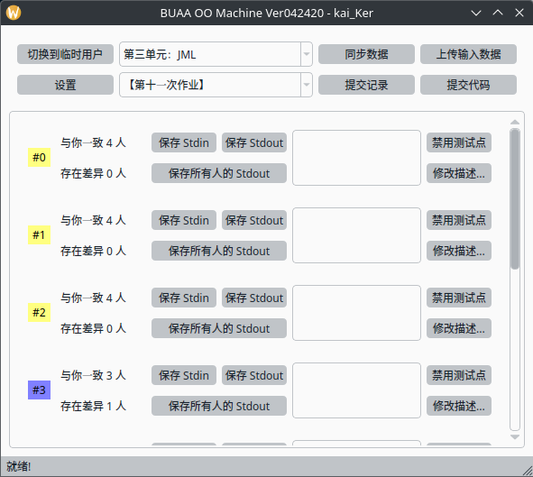
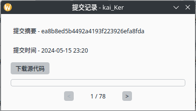
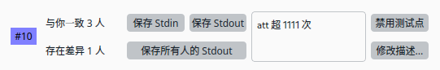
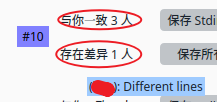

# BUAA-OO-Machine-FrontEnd

BUAA 面向对象课程对拍机，这里是**前端**部分！


## 安装与使用

要求 Python >= 3.10，当然，可能 3.10 也太低了，我不好说，总之可以多多尝试！

使用下列命令安装依赖：

```sh
pip install -r requirements.txt -i https://pypi.tuna.tsinghua.edu.cn/simple
```

**请注意！ Arch/KDE 用户，或者其他内置 Qt6 的系统/桌面的用户，请使用最新版的 PyQt6，否则会找不到系统提供的 ABI**


## 关于设置

**用户名**，因为我在写这个的时候，还不会使用数据库，因此使用文件系统来管理数据，因此，用户名要求是**可以作为文件名的字符串**





**下载路径**与**源代码路径**都要指定，下载路径存放下载的数据、源代码等等，源代码路径则是你 Java 程序的目录，一般以 `src` 结尾，如果使用 `package`，且顶级包名不是 `src`，则不能包含这一层文件夹。

**压缩包密钥**可不填，理论上从服务器监控中可以逆向出该密钥，该密钥会对上传代码进行某种算法的加密，并且下载下来的源代码压缩包是带密码的。聊胜于无吧，还挺有趣的。

**Java 主类**用于启动测评，不带包的话直接填 `public static void main` 的那一个类，使用 `package` 的要将完整包名也带上。

**连接配置**中只要填写服务器信息（地址），需要带上 `http://` 或者 `https://`，以及端口号，管服务器的人肯定知道怎么填，问 TA 就行。WebSocket 地址会自动生成。

你可以选择一个你喜欢的颜色主题，并且体验一下英文（虽然翻译得很烂）。


## 功能介绍

主界面长这样：



**临时用户** 使用临时用户提交的代码不会被记录，但可以参与对拍，不会被其他人看到，非常适用于刀人。

**同步数据** 就是刷新一下全部数据，和服务器同步一下，比如其他同学提交了新的数据点等等。

**上传输入数据** 上传输入数据，并且可以选择性添加描述，不会记录是谁上传的。

**提交记录** 可以看到自己历次提交的代码，并下载，虽然在实际使用中并没有觉得这个功能多有必要，但还是应用户的需求加上了。



**提交代码** 顾名思义，提交一次代码，会对所有测试点进行测试。


下面来看一看具体的测试点：



**保存\*\*** 顾名思义，可以下载一些东西，方便自己 Debug。

**禁用测试点** 就是将它禁用，禁用之后还可以启用。防止有人传错数据点呗，禁用可以删除要好实现多了。

**修改描述** 顾名思义，但是冷知识，这个描述是支持**富文本**的，虽然没有提供直接编辑富文本的能力。

将鼠标放在 **与你一致** 或者是 **存在差异** 上，可以具体看到是哪些同学，以及相关信息，方便你去线下质询。



**测试点编号**是可以点的，可以看到编译、运行的**报错信息**！鼠标放上去也可以看到返回值。

**灰色**代表你还没有提交，**红色**代表编译或运行错误，**蓝紫色**代表存在差异，**绿色**代表完全一致。
